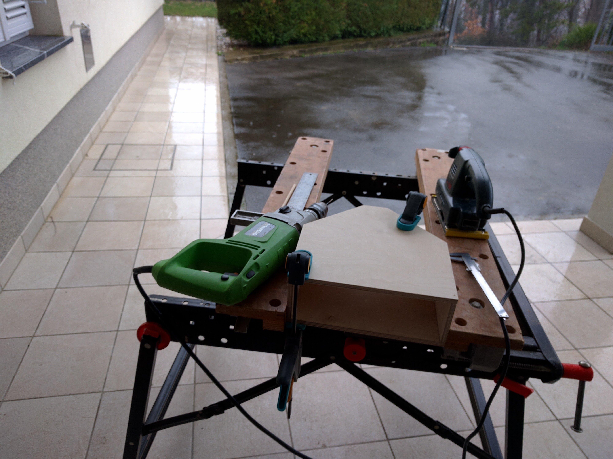
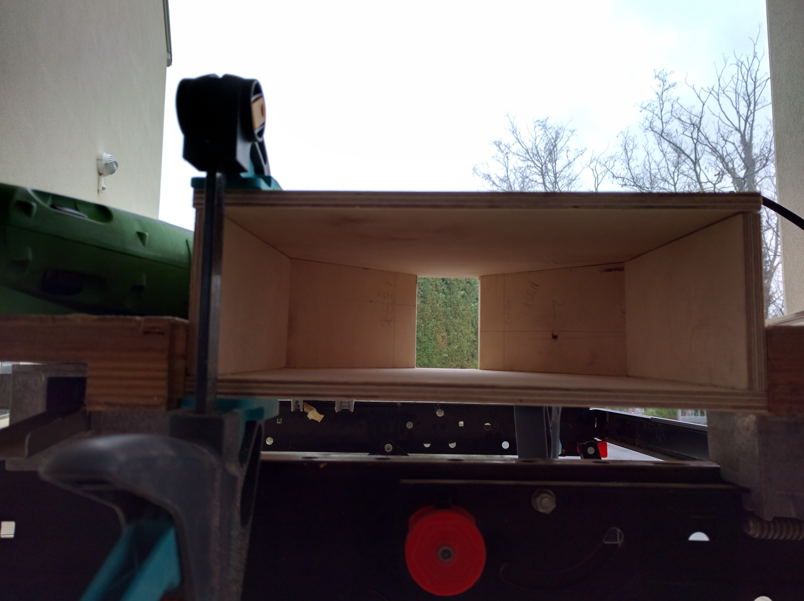
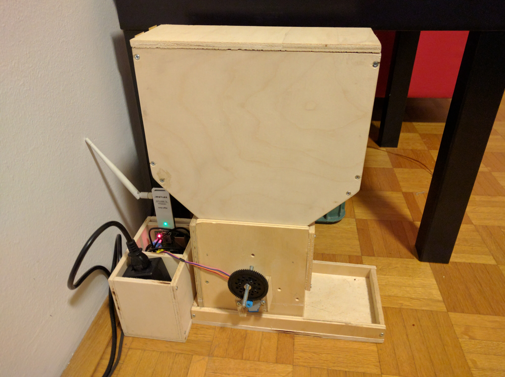
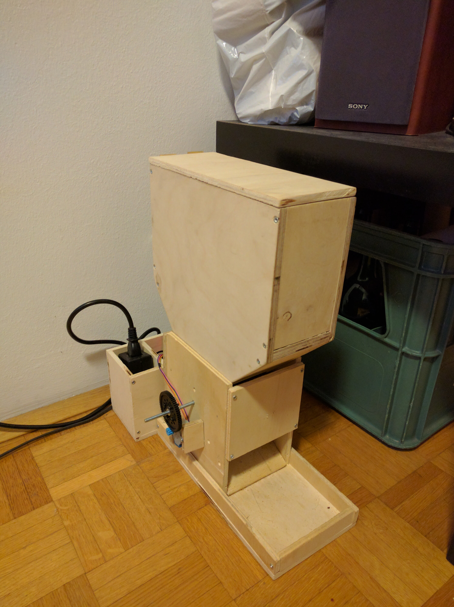

# The first version

The design of the first version was based on the idea to have a central mill-type mechanism that regulates the flow of food from the container on top.

I started drawing the feeder in SolidWorks and after a few iterations I was satisfied with the design. Before the drawing phase I visited the local hardware store to see what kind of plywood do they have available. I decided to use 8mm plywood as it seemed reasonably priced, easy to cut and readily available.

## Building the plywood construction

As I mentioned, one requirement for the design was that simple tools can be used to build it. I successfully built the plywood construction of the first version by using a drill, a jigsaw, a caliper (that is because I am obsessed with millimeter precision), sandpaper, wood glue and a couple of screws and screwdrivers.

{: style="width:49%"}
{: style="width:49%"}

## Actuation and control

The actuation of the mill mechanism and the control was implemented mainly with parts I already had laying around. The list goes something like this:

- Raspberry Pi B+
- TPlink USB wireless adapter
- A simple stepper motor and its controlling PCB
- A power adapter to go from 230V to 5v

I was thinking of providing the links to all of these components but this is kind of pointless as not only is this feeder design outdated, so are some of the components. The Raspberry Pi for example has seen many upgrades.

## Transmission of mechanical power or how I broke my "anyone can build it at home" rule

Once I made coupled the stepper motor to the axle of the mill I quickly came to the realization that I was ... naive. The required torque to spin the mill once the food was loaded in the feeder was way higher than the poor stepper could handle.

I wanted to create something that works first and optimize it later. That is why I then "took a shortcut". That meant using some of the resources I had available in the robotics lab where I was doing my PhD.

Mainly I needed to add gears between the axle of the mill and the stepper. I took a gear that was not being in use and I 3D printed the other one. Attaching the big gear to the mill axle required an additional component ... some kind of adapter/mounting bracket. I asked a mechanical engineer to give me a quick introduction into how to operate a lathe and I did it out of aluminium.

Additionally, also the mill itself needed a 3D printed part. No matter what I tried, using wooden blades simply didn't cut it. So I ended up using some kind of flexible plastic foil for blades and I fixed them to the axle using a 3D printed foil holding piece. Not grate but it did the job.

## Completed version

The final shape of the first working prototype was ready.

{: style="width:49%"}

{: style="width:49%"}

## The problems

To be continued ...