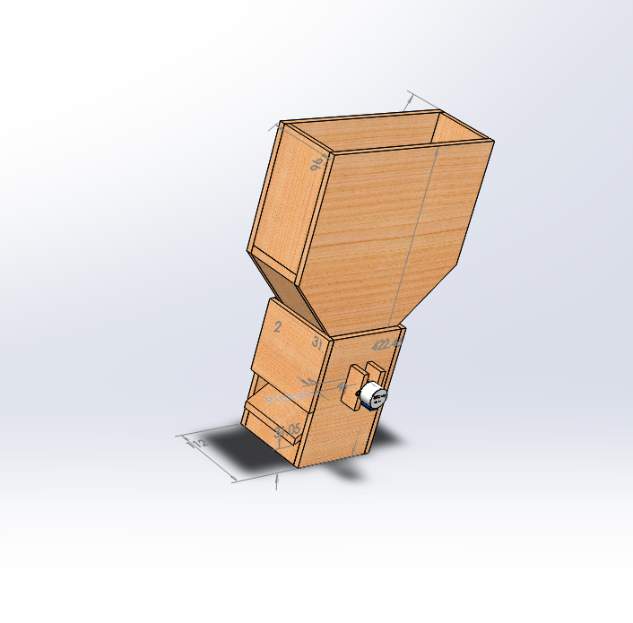
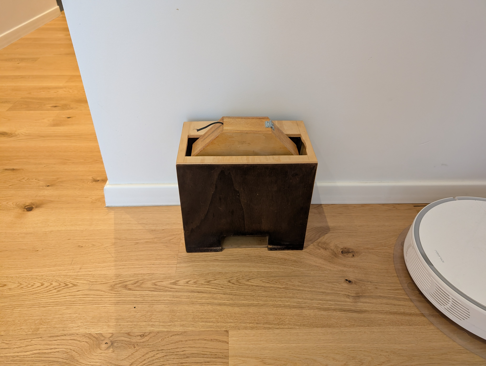

# Automated cat feeder

I have cats. I love my cats. Feeding them, however, can sometimes be a bit of a chore. Additionally, I cannot give them the food if I am not there!

That's why I decided to make a cat feeder!

<!-- 
 -->
  <!-- <iframe src="media/VID_20171024_223716.mp4" frameborder="0" allowfullscreen
      style="position:absolute;top:0;left:0;width:100%;height:100%;"></iframe> -->
  <!-- <iframe src="https://i.imgur.com/r6oTF8Z.mp4" frameborder="0" allowfullscreen
      style="position:absolute;top:0;left:0;width:100%;height:100%;"></iframe>
</iframe> -->
<blockquote class="imgur-embed-pub" lang="en" data-id="a/7uHfw91" data-context="false" ></blockquote>

The video was recorded back in 2017 when I completed the second version of the feeder. It was powered by a Raspberry Pi Zero W. It ran a webserver offering a basic UI to trigger the feeding or set a schedule.

It started with an idea and a design in CAD software ...

{ width="500", loading=lazy }
/// caption
The CAD drawing of the first cat feeder as in 2018.
///

... and ended as a device that reliably feeds my feline masters.

{ width="500", loading=lazy }
/// caption
The cat feeder as it stands in 2025.
///

# Motivation

# Requirements

# First version

# Second version
